<div align="center">

# VPSMonitor

**A native macOS menu bar app for monitoring multiple Linux VPS hosts over SSH**

*No agent. No cloud. No setup on the server side.*

[](https://www.apple.com/macos/)
[](https://swift.org)
[](LICENSE)
[](https://github.com/thealexpm/VPSMonitor/stargazers)

[English](#english) · [Русский](#русский) · [Download](https://github.com/thealexpm/VPSMonitor/releases) · [Support](https://t.me/thealexpm)

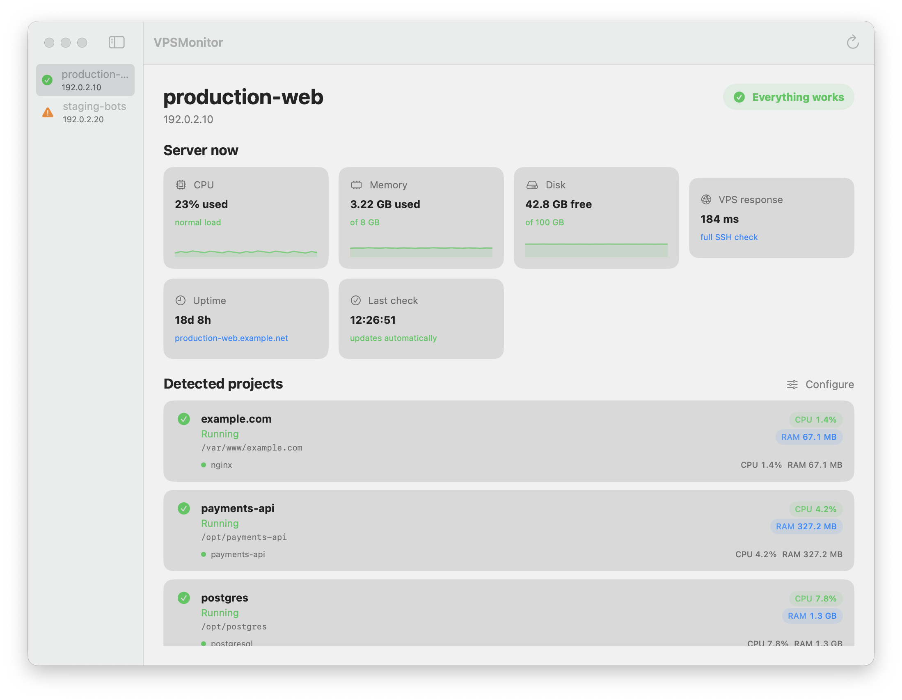

</div>

---

<a id="english"></a>

## What it does

VPSMonitor lives in your menu bar and shows live state of your Linux servers in real time. It connects over SSH using your existing keys (or a password), runs a small read-only bash script remotely, and brings the result back to a clean native dashboard — without installing anything on the server.

## Features

|  |  |
|---|---|
| 🚀 **Zero server-side setup** | No agent to install, no daemon to keep alive, no open port |
| 🔒 **Privacy by design** | Local-first: data never leaves your Mac. Passwords stored in macOS Keychain |
| 📊 **Per-service stats** | CPU and RAM consumed by each running service, not just totals |
| 🔍 **Smart project discovery** | Scans `/opt`, `/var/www`, `/srv`, `/app`, `/home/*` and links projects to their `systemd` units |
| 🔔 **Push notifications** | macOS alerts when a server goes down, recovers, or a service stops |
| 📈 **Metric history** | Sparkline charts build up as the app polls your servers |
| 🌐 **Multiple servers** | Add, edit, delete from Settings — selectable from the sidebar and the menu bar |
| 🔑 **Key or password auth** | Use existing SSH keys or store credentials securely in Keychain |
| 🆕 **Auto-update check** | Tells you when a new release is available on GitHub |

## Screenshots

<table>
  <tr>
    <td>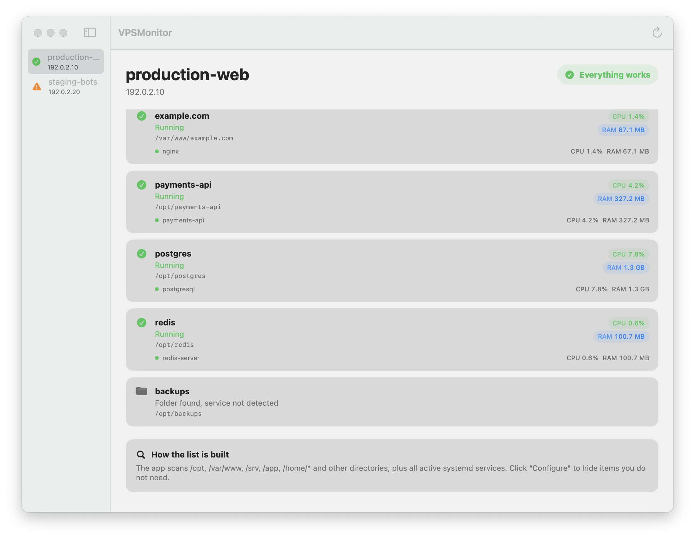</td>
    <td>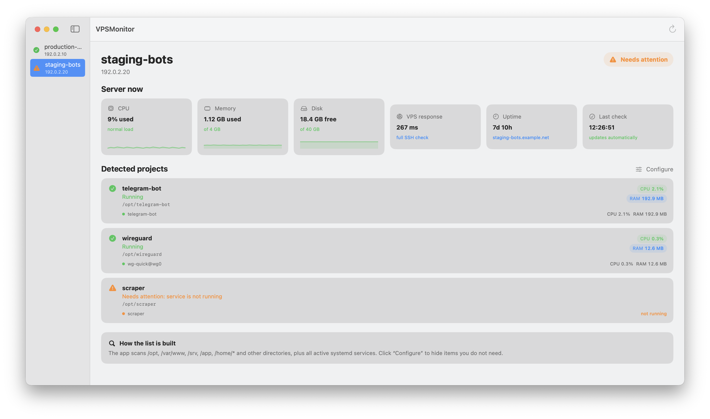</td>
  </tr>
  <tr>
    <td align="center"><sub>Per-service CPU and RAM, project paths, statuses</sub></td>
    <td align="center"><sub>Stopped service surfaces a clear warning</sub></td>
  </tr>
  <tr>
    <td>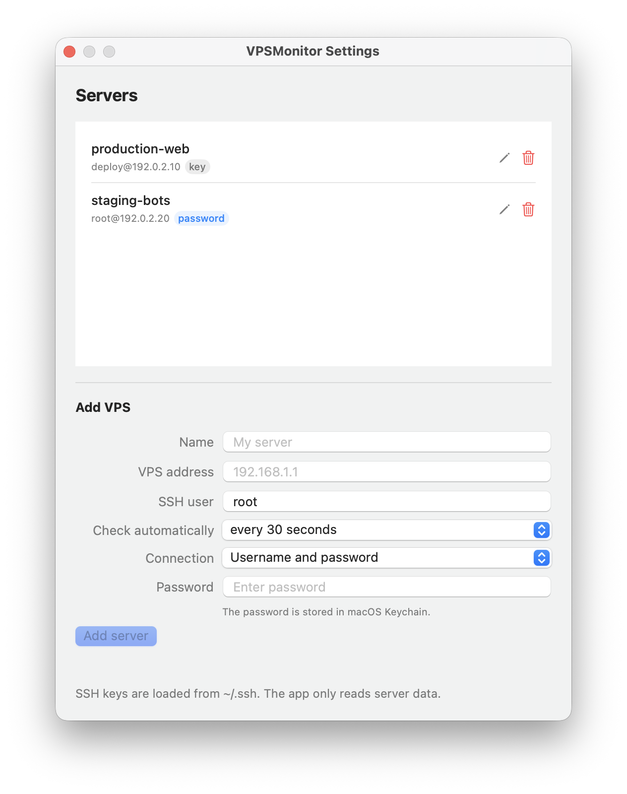</td>
    <td>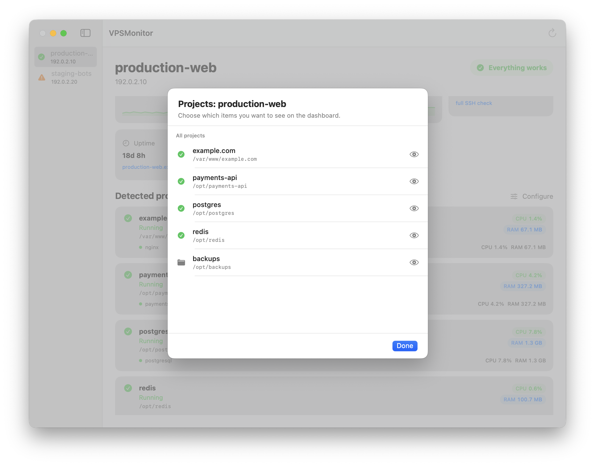</td>
  </tr>
  <tr>
    <td align="center"><sub>Add/edit/delete servers, SSH key or password</sub></td>
    <td align="center"><sub>Hide what you don't want to see on the dashboard</sub></td>
  </tr>
  <tr>
    <td>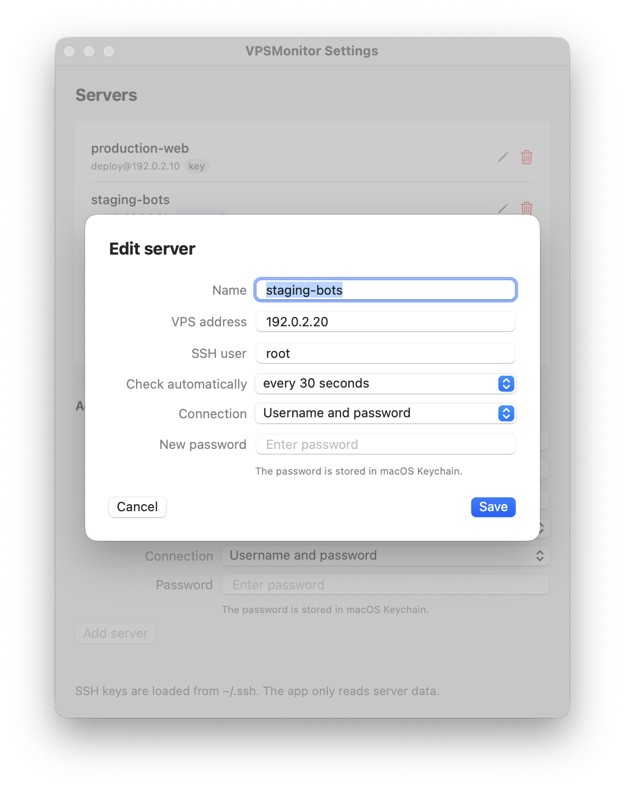</td>
    <td>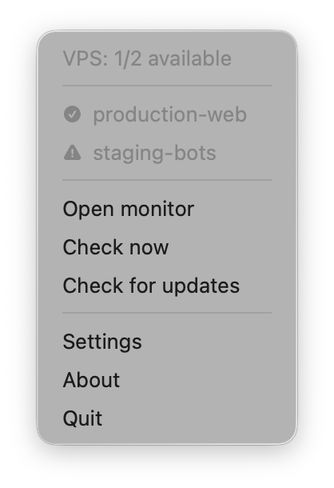</td>
  </tr>
  <tr>
    <td align="center"><sub>Edit server details in a focused sheet</sub></td>
    <td align="center"><sub>Menu bar: all servers at a glance</sub></td>
  </tr>
  <tr>
    <td colspan="2" align="center">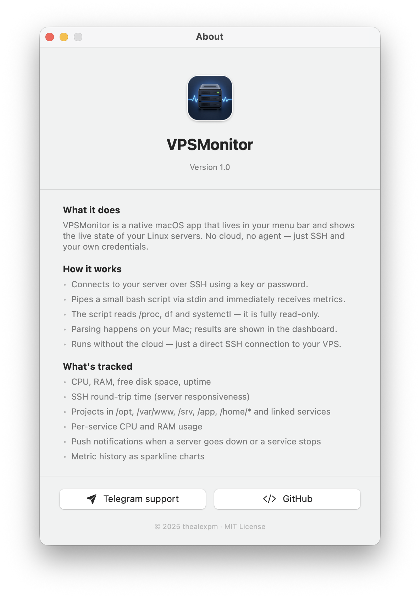</td>
  </tr>
  <tr>
    <td colspan="2" align="center"><sub>About window — automatically switches between English and Russian based on system language</sub></td>
  </tr>
</table>

## Requirements

| Requirement | Version |
|---|---|
| macOS | 14 Sonoma or later |
| SSH access to your server | key-based or password |
| Xcode Command Line Tools | for building from source |

## Install

### Option A — download a release (recommended)

1. Grab the latest `VPSMonitor.dmg` from [Releases](https://github.com/thealexpm/VPSMonitor/releases)
2. Open the DMG and drag VPSMonitor.app to `/Applications`
3. Launch — click the menu bar icon → **Settings** → add your first VPS

### Option B — build from source

```bash
git clone https://github.com/thealexpm/VPSMonitor.git
cd VPSMonitor
./script/build_and_run.sh
```

The script compiles, ad-hoc-signs the bundle, drops it in `dist/VPSMonitor.app`, and launches it.

## Setting up SSH access

The app uses whatever SSH key is already loaded in your agent or configured in `~/.ssh/config`. To make sure it works:

```bash
ssh user@your.server.address "echo ok"
```

If you see `ok`, the app will connect. If you'd rather not use keys — add the server in Settings with **Подключение → Логин и пароль** and store credentials in macOS Keychain.

### Connect with IP, login and password

An SSH key is optional. You can connect a server manually without editing `~/.ssh/config`:

1. Open **Settings** and add a new VPS
2. Enter the server IP address or hostname
3. Enter the SSH login
4. Select **Подключение → Логин и пароль**
5. Enter the password — VPSMonitor stores it securely in macOS Keychain

The app still uses the standard SSH protocol under the hood, but no preconfigured SSH key is required.

For non-standard ports add a Host block to `~/.ssh/config`:

```
Host my-vps
    HostName your.server.address
    User root
    Port 2222
    IdentityFile ~/.ssh/id_ed25519
```

Then use `my-vps` as the host inside the app.

## How it works

Every refresh cycle:

1. Opens an SSH connection using your key or stored password
2. Pipes a self-contained bash script via `stdin` to `bash -s` — no files are written
3. The script reads `/proc/stat`, `/proc/meminfo`, `df`, `/proc/uptime`, `systemctl` and `ps`
4. Output is parsed on the Mac side
5. Projects are matched by directory + `WorkingDirectory` of each `systemd` unit
6. Per-service CPU and RAM are fetched via `ps -p <MainPID> -o %cpu= -o rss=`

The server is never modified. The script exits cleanly each run.

## Project structure

```
Sources/
  VPSMonitor/           SwiftUI app: menu bar, dashboard, settings, about
  VPSMonitorCore/       Models, services, SSH, Keychain, update checker
  VPSMonitorProbe/      CLI probe for testing SSH connectivity
Tests/
  VPSMonitorCoreTests/  Unit tests for the inventory parser
Resources/
  AppIcon.icns          App icon
  screenshots/          README screenshots
script/
  build_and_run.sh      One-command build + launch (ad-hoc signed)
  release.sh            Developer-ID signed + notarized release builder
```

## Releasing (for maintainers)

For signed/notarized builds you'll need an Apple Developer Program membership ($99/year). Then:

```bash
export DEV_ID_NAME="Developer ID Application: Your Name (TEAMID)"
export NOTARY_PROFILE="VPSMonitor-Notary"
./script/release.sh 1.1
```

Outputs `dist/VPSMonitor-1.1.dmg` ready to upload to GitHub Releases. See comments at the top of [`script/release.sh`](script/release.sh) for one-time setup details.

## Support and contributions

- Issues and feature requests: [GitHub Issues](https://github.com/thealexpm/VPSMonitor/issues)
- Direct contact: [@thealexpm on Telegram](https://t.me/thealexpm)
- Pull requests welcome

## License

MIT — see [LICENSE](LICENSE).

---

<a id="русский"></a>

## Что это

VPSMonitor — нативное macOS-приложение, которое живёт в строке меню и в реальном времени показывает состояние ваших Linux-серверов. Подключается по SSH вашими ключами или паролем, запускает удалённо небольшой read-only bash-скрипт и приносит результат в чистый нативный дашборд. На сервер ничего ставить не нужно.

<div align="center">
  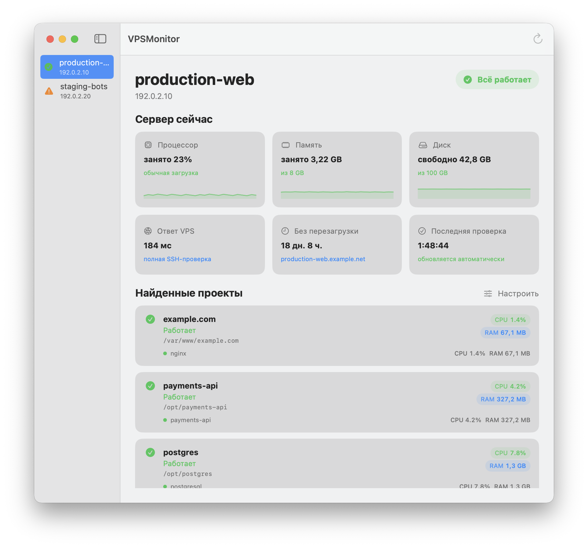
</div>

## Возможности

|  |  |
|---|---|
| 🚀 **Ноль настройки на сервере** | Никаких агентов, демонов или открытых портов |
| 🔒 **Приватность** | Всё локально на Mac. Пароли — в Связке ключей macOS |
| 📊 **Статистика по службам** | CPU и RAM по каждой работающей службе, а не только суммарно |
| 🔍 **Умный поиск проектов** | Сканирует `/opt`, `/var/www`, `/srv`, `/app`, `/home/*` и связывает папки с `systemd`-юнитами |
| 🔔 **Push-уведомления** | Алёрт macOS когда сервер падает, восстанавливается или служба остановилась |
| 📈 **История метрик** | Спарклайн-графики накапливаются по мере опроса |
| 🌐 **Несколько серверов** | Добавление, редактирование, удаление в настройках |
| 🔑 **Ключ или пароль** | Существующий SSH-ключ или пароль в Связке ключей |
| 🆕 **Авто-проверка обновлений** | Сообщает когда вышла новая версия на GitHub |

## Скриншоты

<table>
  <tr>
    <td>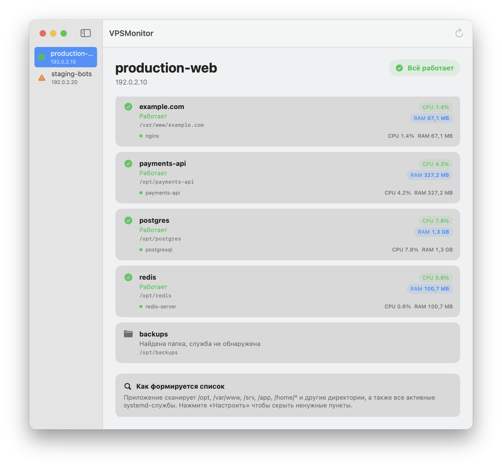</td>
    <td>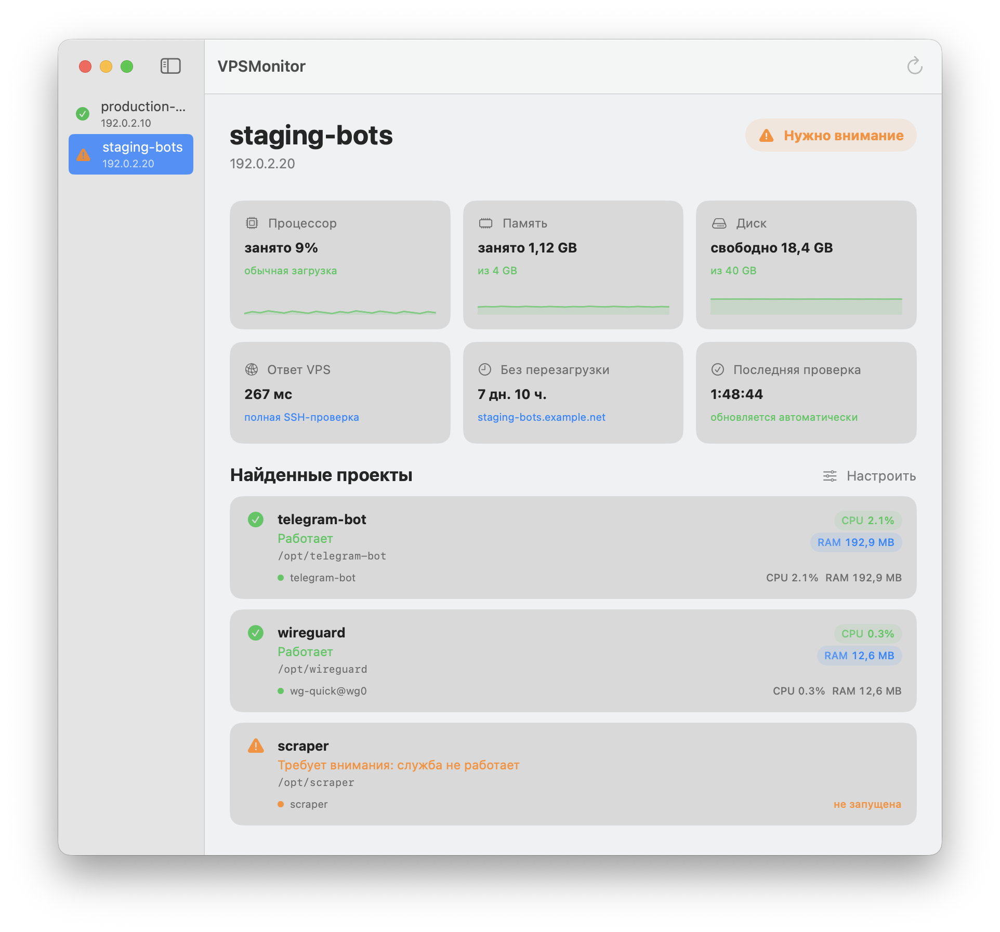</td>
  </tr>
  <tr>
    <td align="center"><sub>CPU и RAM по каждой службе, пути проектов, статусы</sub></td>
    <td align="center"><sub>Остановленная служба сразу заметна</sub></td>
  </tr>
  <tr>
    <td>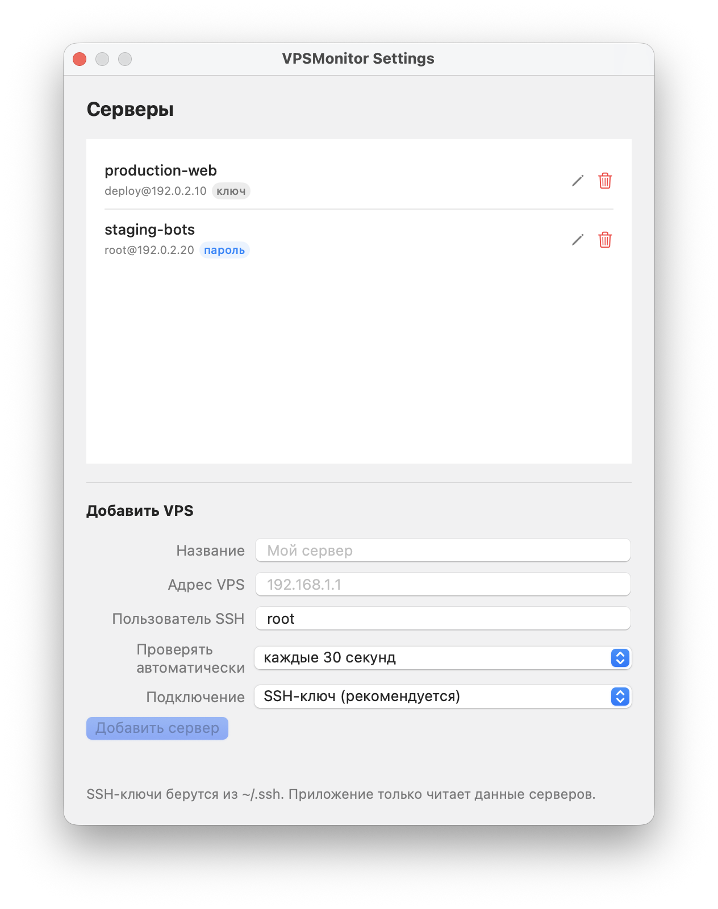</td>
    <td>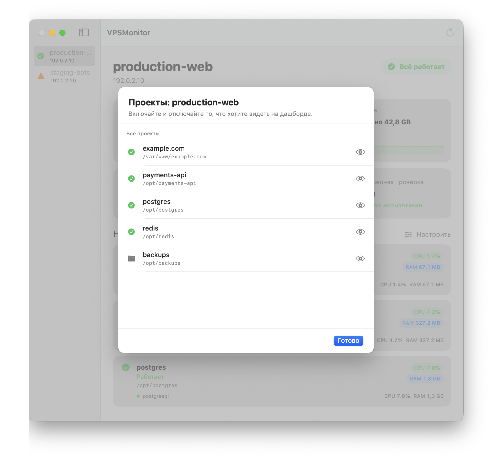</td>
  </tr>
  <tr>
    <td align="center"><sub>Добавление, редактирование, удаление серверов — ключ или пароль</sub></td>
    <td align="center"><sub>Скрывайте то, что не хотите видеть на дашборде</sub></td>
  </tr>
  <tr>
    <td>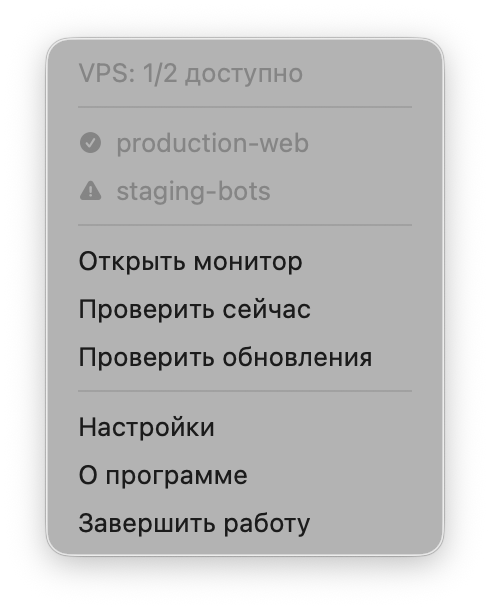</td>
    <td>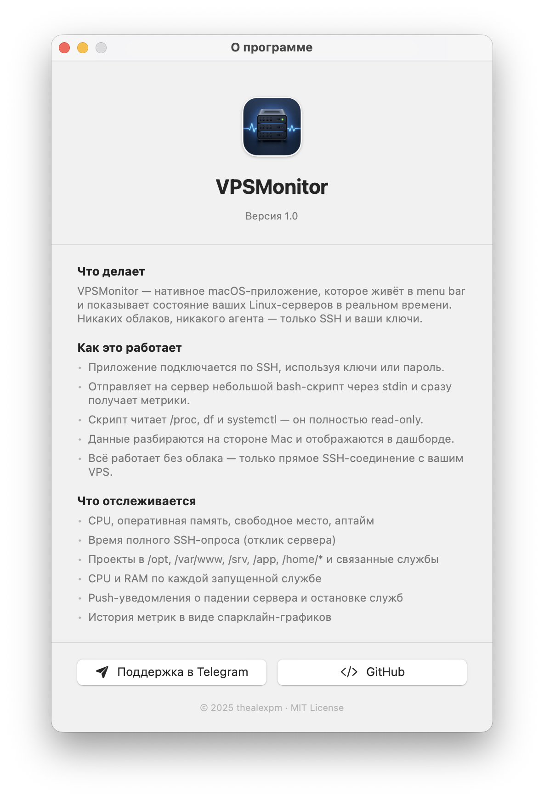</td>
  </tr>
  <tr>
    <td align="center"><sub>Строка меню: все серверы на одном экране</sub></td>
    <td align="center"><sub>О программе — текст подстраивается под язык системы</sub></td>
  </tr>
</table>

## Требования

| Требование | Версия |
|---|---|
| macOS | 14 Sonoma или новее |
| SSH-доступ к серверу | ключ или пароль |
| Xcode Command Line Tools | для сборки из исходников |

## Установка

### Вариант A — скачать релиз (рекомендуется)

1. Возьмите свежий `VPSMonitor.dmg` со [страницы релизов](https://github.com/thealexpm/VPSMonitor/releases)
2. Откройте DMG и перетащите VPSMonitor.app в `/Applications`
3. Запустите — клик по иконке в menu bar → **Настройки** → добавьте первый VPS

### Вариант B — собрать из исходников

```bash
git clone https://github.com/thealexpm/VPSMonitor.git
cd VPSMonitor
./script/build_and_run.sh
```

Скрипт компилирует, ad-hoc-подписывает, кладёт `.app` в `dist/` и запускает.

## SSH-доступ

Приложение использует тот SSH-ключ, который уже загружен в агент или прописан в `~/.ssh/config`. Проверка:

```bash
ssh user@your.server.address "echo ok"
```

Если выводит `ok` — приложение тоже подключится. Если не хочется ключ — в настройках выберите **Подключение → Логин и пароль**, пароль сохранится в Связке ключей.

### Подключение по IP, логину и паролю

SSH-ключ необязателен. Сервер можно подключить вручную без настройки `~/.ssh/config`:

1. Откройте **Настройки** и добавьте новый VPS
2. Укажите IP-адрес или hostname сервера
3. Укажите логин SSH
4. Выберите **Подключение → Логин и пароль**
5. Введите пароль — VPSMonitor безопасно сохранит его в Связке ключей macOS

Внутри приложение по-прежнему использует стандартный протокол SSH, но заранее настроенный SSH-ключ не требуется.

Для нестандартного порта добавьте блок в `~/.ssh/config`:

```
Host my-vps
    HostName your.server.address
    User root
    Port 2222
    IdentityFile ~/.ssh/id_ed25519
```

И укажите `my-vps` в качестве хоста.

## Как работает

Каждый цикл опроса:

1. Открывается SSH-соединение по ключу или сохранённому паролю
2. Через stdin отправляется самодостаточный bash-скрипт — на сервере не создаются файлы
3. Скрипт читает `/proc/stat`, `/proc/meminfo`, `df`, `/proc/uptime`, `systemctl` и `ps`
4. Вывод парсится уже на Mac
5. Проекты связываются по совпадению пути и `WorkingDirectory` юнитов
6. CPU и RAM по службам берутся через `ps -p <MainPID> -o %cpu= -o rss=`

Сервер ничего не записывает. Скрипт завершается чисто после каждого запуска.

## Поддержка

- Issues и предложения: [GitHub Issues](https://github.com/thealexpm/VPSMonitor/issues)
- Прямой контакт: [@thealexpm в Telegram](https://t.me/thealexpm)
- Pull requests приветствуются

## Лицензия

MIT — см. [LICENSE](LICENSE).
