<div align="center">

# VPSMonitor

**A native macOS menu bar app for monitoring multiple Linux VPS hosts over SSH**

*No agent. No cloud. No setup on the server side.*

[](https://www.apple.com/macos/)
[](https://swift.org)
[](LICENSE)
[](https://github.com/thealexpm/VPSMonitor/stargazers)

[English](#english) · [Русский](#русский) · [Español](#español) · [中文](#中文) · [Download](https://github.com/thealexpm/VPSMonitor/releases) · [Support](https://t.me/thealexpm)

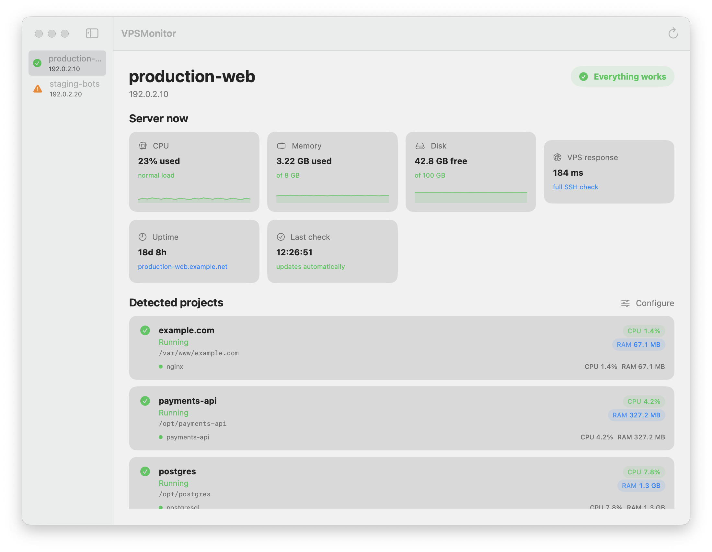

</div>

---

<a id="english"></a>

## What it does

VPSMonitor lives in your menu bar and shows live state of your Linux servers in real time. It connects over SSH using your existing keys (or a password), runs a small read-only bash script remotely, and brings the result back to a clean native dashboard — without installing anything on the server.

## Features

|  |  |
|---|---|
| 🚀 **Zero server-side setup** | No agent to install, no daemon to keep alive, no open port |
| 🔒 **Privacy by design** | Local-first: data never leaves your Mac. Passwords stored in macOS Keychain |
| 📊 **Per-service stats** | CPU and RAM consumed by each running service, not just totals |
| 🔍 **Smart project discovery** | Scans `/opt`, `/var/www`, `/srv`, `/app`, `/home/*`, links projects to `systemd` units and live processes |
| 🔔 **Push notifications** | macOS alerts when a server goes down, recovers, or a service stops |
| 📈 **Metric history** | Local history, sparkline charts and a dedicated history window |
| 🧭 **Incident analysis** | Highlights anomalies, builds a copyable incident snapshot and suggests manual check commands |
| 🌐 **Multiple servers** | Add, edit, delete from Settings — selectable from the sidebar and the menu bar |
| 🏳️ **Country flags** | IP-based country lookup with local caching, all-country search and manual override |
| 🌍 **App languages** | Russian, English, Spanish and Chinese selectable inside the app |
| 🔑 **Key or password auth** | Use existing SSH keys or store credentials securely in Keychain |
| 🆕 **Auto-update check** | Tells you when a new release is available on GitHub |

## Screenshots

<table>
  <tr>
    <td>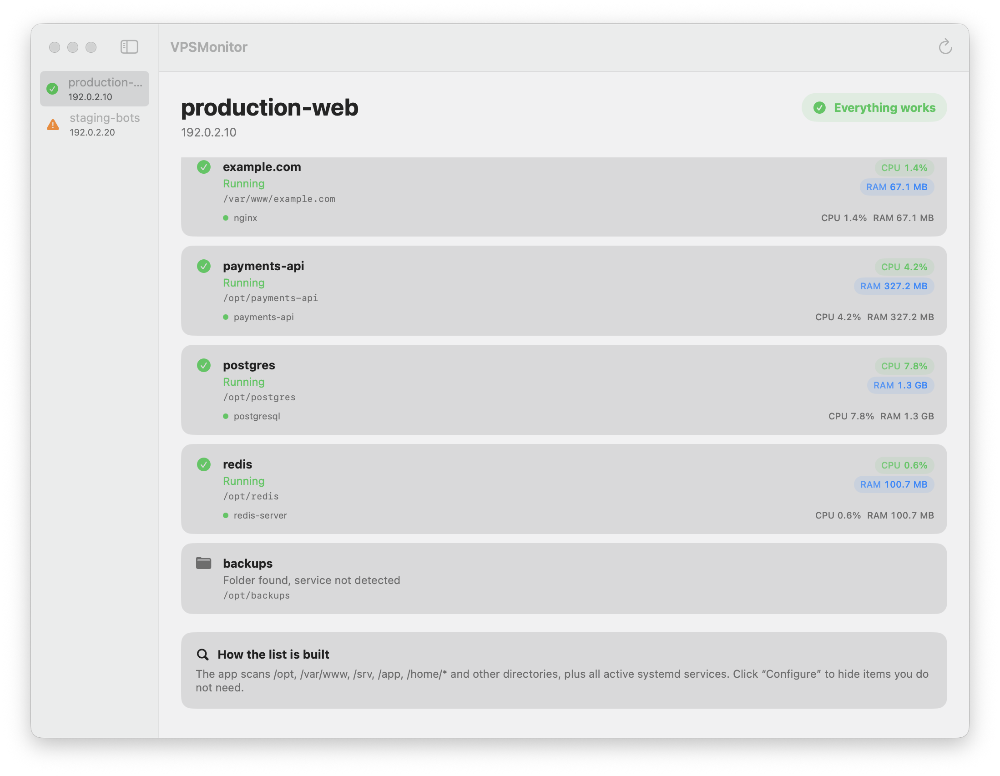</td>
    <td>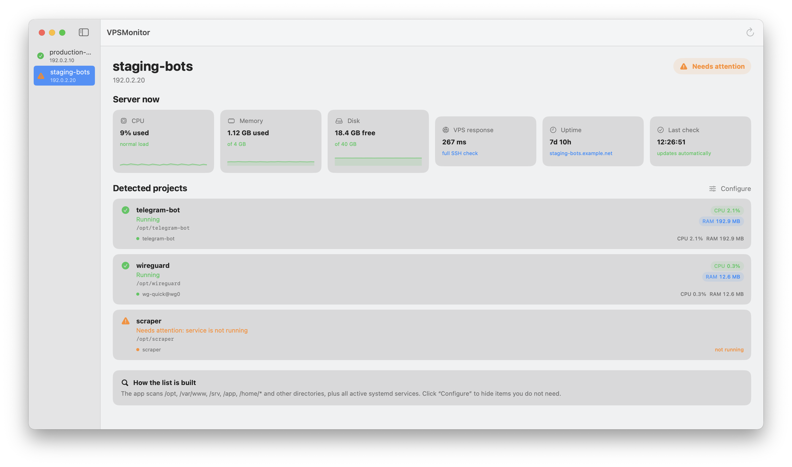</td>
  </tr>
  <tr>
    <td align="center"><sub>Per-service CPU and RAM, project paths, statuses</sub></td>
    <td align="center"><sub>Stopped service surfaces a clear warning</sub></td>
  </tr>
  <tr>
    <td>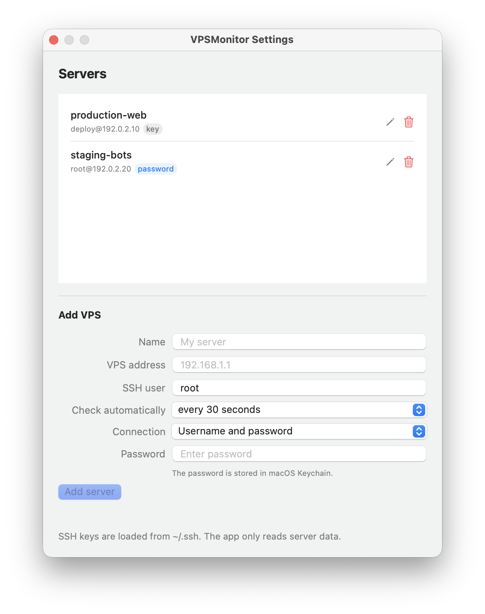</td>
    <td>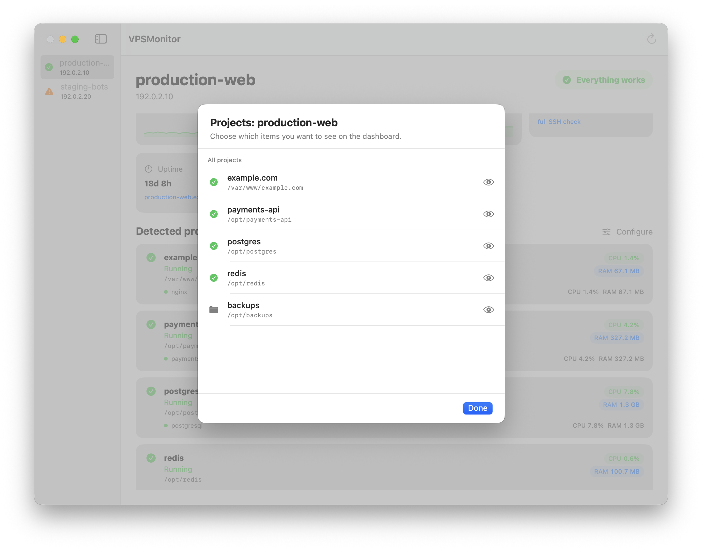</td>
  </tr>
  <tr>
    <td align="center"><sub>Add/edit/delete servers, SSH key or password</sub></td>
    <td align="center"><sub>Hide what you don't want to see on the dashboard</sub></td>
  </tr>
  <tr>
    <td>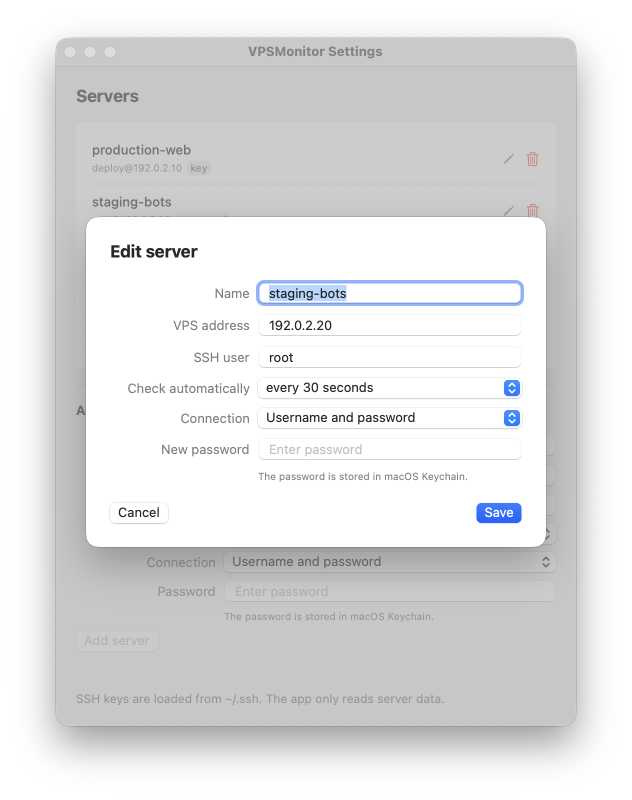</td>
    <td>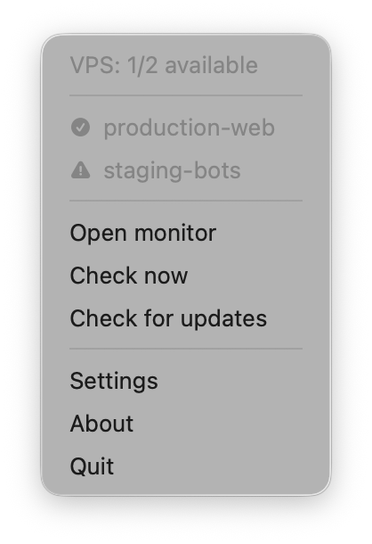</td>
  </tr>
  <tr>
    <td align="center"><sub>Edit server details in a focused sheet</sub></td>
    <td align="center"><sub>Menu bar: all servers at a glance</sub></td>
  </tr>
  <tr>
    <td colspan="2" align="center">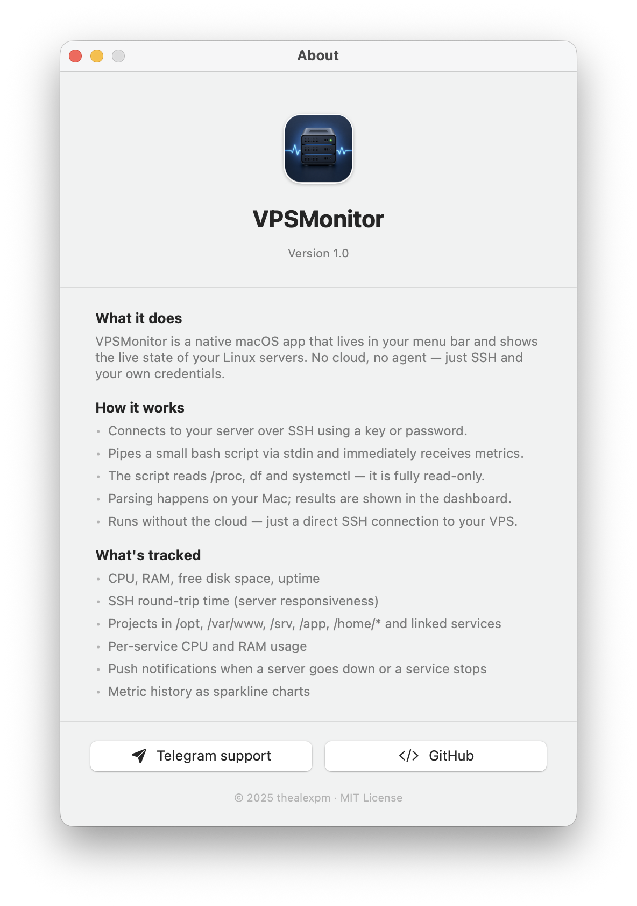</td>
  </tr>
  <tr>
    <td colspan="2" align="center"><sub>About window — automatically switches between English and Russian based on system language</sub></td>
  </tr>
</table>

## Requirements

| Requirement | Version |
|---|---|
| macOS | 14 Sonoma or later |
| SSH access to your server | key-based or password |
| Xcode Command Line Tools | for building from source |

## Install

### Option A — download a release (recommended)

1. Grab the latest `VPSMonitor.dmg` from [Releases](https://github.com/thealexpm/VPSMonitor/releases)
2. Open the DMG and drag VPSMonitor.app to `/Applications`
3. Launch — click the menu bar icon → **Settings** → add your first VPS

### Option B — build from source

```bash
git clone https://github.com/thealexpm/VPSMonitor.git
cd VPSMonitor
./script/build_and_run.sh
```

The script compiles, ad-hoc-signs the bundle, drops it in `dist/VPSMonitor.app`, and launches it.

## Setting up SSH access

The app uses whatever SSH key is already loaded in your agent or configured in `~/.ssh/config`. To make sure it works:

```bash
ssh user@your.server.address "echo ok"
```

If you see `ok`, the app will connect. If you'd rather not use keys — add the server in Settings with **Подключение → Логин и пароль** and store credentials in macOS Keychain.

### Connect with IP, login and password

An SSH key is optional. You can connect a server manually without editing `~/.ssh/config`:

1. Open **Settings** and add a new VPS
2. Enter the server IP address or hostname
3. Enter the SSH login
4. Select **Подключение → Логин и пароль**
5. Enter the password — VPSMonitor stores it securely in macOS Keychain

The app still uses the standard SSH protocol under the hood, but no preconfigured SSH key is required.

For non-standard ports add a Host block to `~/.ssh/config`:

```
Host my-vps
    HostName your.server.address
    User root
    Port 2222
    IdentityFile ~/.ssh/id_ed25519
```

Then use `my-vps` as the host inside the app.

## How it works

Every refresh cycle:

1. Opens an SSH connection using your key or stored password
2. Pipes a self-contained bash script via `stdin` to `bash -s` — no files are written
3. The script reads `/proc/stat`, `/proc/meminfo`, `df`, `/proc/uptime`, `systemctl` and `ps`
4. Output is parsed on the Mac side
5. Projects are matched by directory + `WorkingDirectory` of each `systemd` unit
6. Per-service CPU and RAM are fetched via `ps -p <MainPID> -o %cpu= -o rss=`

The server is never modified. The script exits cleanly each run.

## Project structure

```
Sources/
  VPSMonitor/           SwiftUI app: menu bar, dashboard, settings, help, about
  VPSMonitorCore/       Models, services, SSH, Keychain, i18n, GeoIP, update checker
  VPSMonitorProbe/      CLI probe for testing SSH connectivity
Tests/
  VPSMonitorCoreTests/  Unit tests for the inventory parser
Resources/
  AppIcon.icns          App icon
  screenshots/          README screenshots
script/
  build_and_run.sh      One-command build + launch (ad-hoc signed)
  release.sh            Developer-ID signed + notarized release builder
  package_unsigned.sh   Local unsigned ZIP/DMG package for testing
```

## Releasing (for maintainers)

For signed/notarized builds you'll need an Apple Developer Program membership ($99/year). Then:

```bash
export DEV_ID_NAME="Developer ID Application: Your Name (TEAMID)"
export NOTARY_PROFILE="VPSMonitor-Notary"
./script/release.sh 1.1
```

Outputs `dist/VPSMonitor-1.1.dmg` ready to upload to GitHub Releases. See comments at the top of [`script/release.sh`](script/release.sh) for one-time setup details.

## Support and contributions

- Issues and feature requests: [GitHub Issues](https://github.com/thealexpm/VPSMonitor/issues)
- Direct contact: [@thealexpm on Telegram](https://t.me/thealexpm)
- Pull requests welcome
- Thanks to [Angel-M-R](https://github.com/Angel-M-R) for the first public fork and the ideas behind local SSH server import, SSH password fallback, clearer connection errors, and hidden-project-aware health status.

## License

MIT — see [LICENSE](LICENSE).

---

<a id="русский"></a>

## Что это

VPSMonitor — нативное macOS-приложение, которое живёт в строке меню и в реальном времени показывает состояние ваших Linux-серверов. Подключается по SSH вашими ключами или паролем, запускает удалённо небольшой read-only bash-скрипт и приносит результат в чистый нативный дашборд. На сервер ничего ставить не нужно.

<div align="center">
  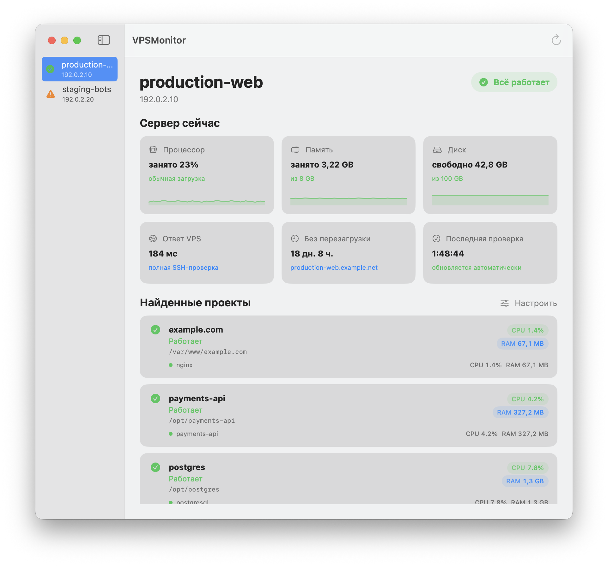
</div>

## Возможности

|  |  |
|---|---|
| 🚀 **Ноль настройки на сервере** | Никаких агентов, демонов или открытых портов |
| 🔒 **Приватность** | Всё локально на Mac. Пароли — в Связке ключей macOS |
| 📊 **Статистика по службам** | CPU и RAM по каждой работающей службе, а не только суммарно |
| 🔍 **Умный поиск проектов** | Сканирует `/opt`, `/var/www`, `/srv`, `/app`, `/home/*` и связывает папки с `systemd`-юнитами и живыми процессами |
| 🔔 **Push-уведомления** | Алёрт macOS когда сервер падает, восстанавливается или служба остановилась |
| 📈 **История метрик** | Локальная история, спарклайны и отдельное окно графиков |
| 🧭 **Разбор инцидента** | Подсвечивает отклонения, копирует snapshot инцидента и предлагает команды проверки |
| 🌐 **Несколько серверов** | Добавление, редактирование, удаление в настройках |
| 🏳️ **Флаги стран** | GeoIP lookup по IP с локальным кэшем, поиск по всем странам и ручной override |
| 🌍 **Языки приложения** | Русский, английский, испанский и китайский переключаются внутри приложения |
| 🔑 **Ключ или пароль** | Существующий SSH-ключ или пароль в Связке ключей |
| 🆕 **Авто-проверка обновлений** | Сообщает когда вышла новая версия на GitHub |

## Скриншоты

<table>
  <tr>
    <td>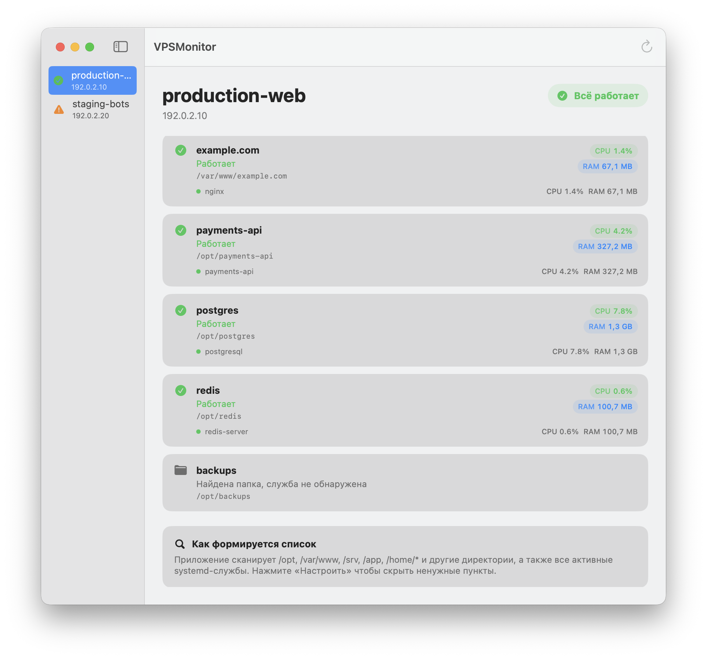</td>
    <td>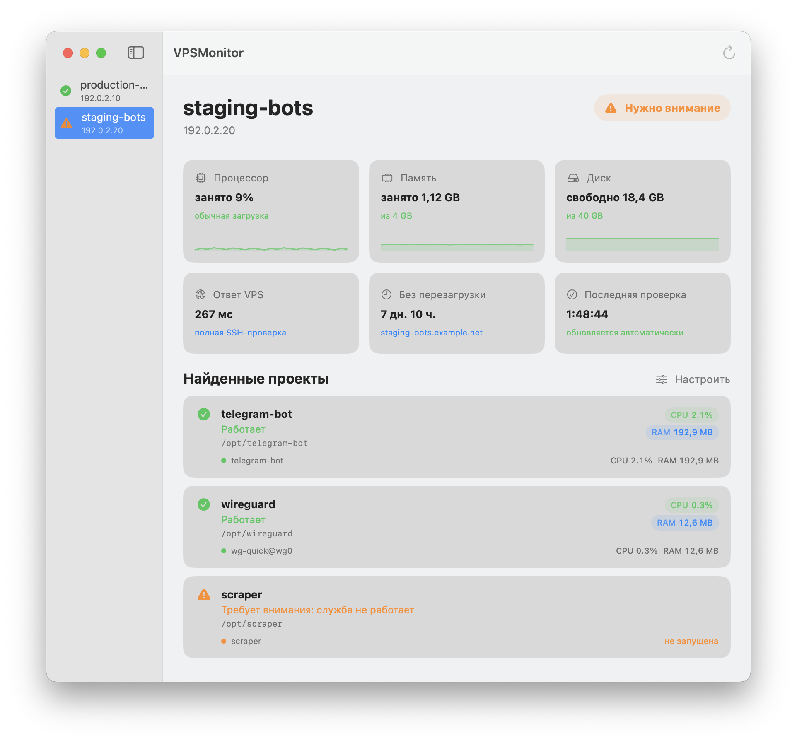</td>
  </tr>
  <tr>
    <td align="center"><sub>CPU и RAM по каждой службе, пути проектов, статусы</sub></td>
    <td align="center"><sub>Остановленная служба сразу заметна</sub></td>
  </tr>
  <tr>
    <td>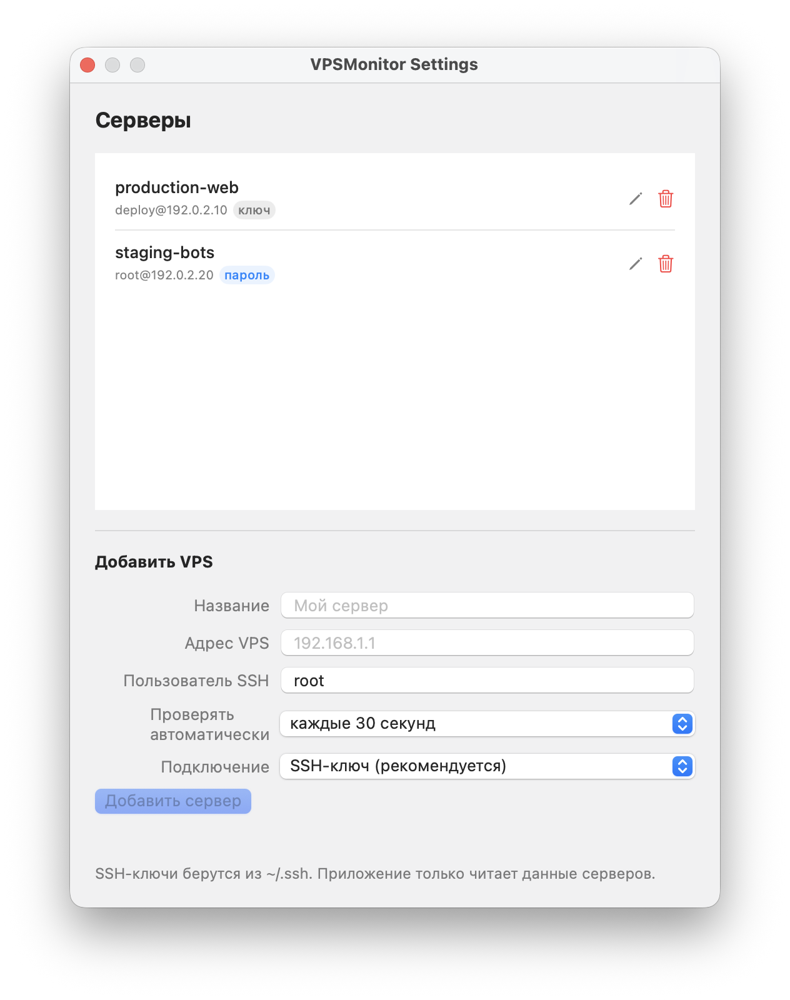</td>
    <td>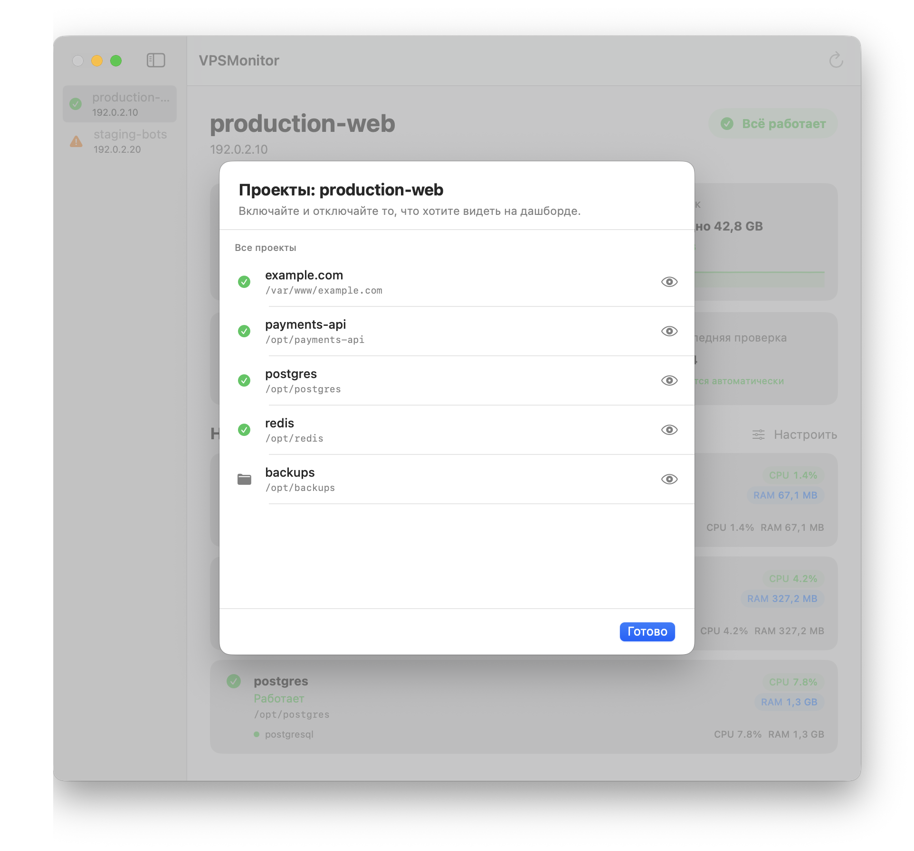</td>
  </tr>
  <tr>
    <td align="center"><sub>Добавление, редактирование, удаление серверов — ключ или пароль</sub></td>
    <td align="center"><sub>Скрывайте то, что не хотите видеть на дашборде</sub></td>
  </tr>
  <tr>
    <td>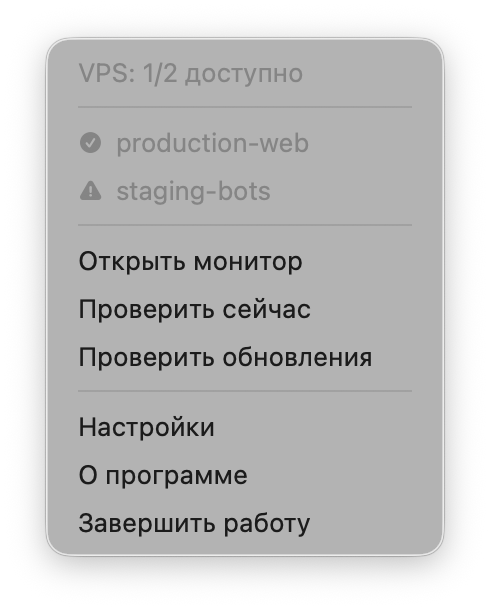</td>
    <td>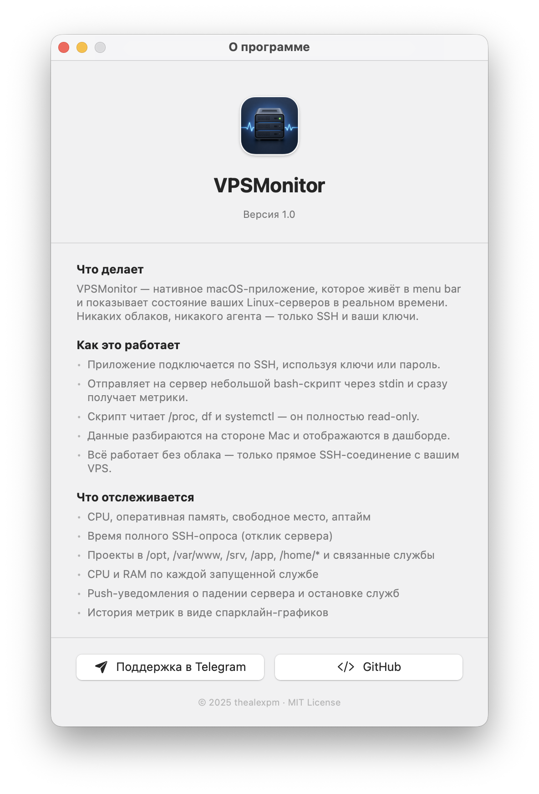</td>
  </tr>
  <tr>
    <td align="center"><sub>Строка меню: все серверы на одном экране</sub></td>
    <td align="center"><sub>О программе — текст подстраивается под язык системы</sub></td>
  </tr>
</table>

## Требования

| Требование | Версия |
|---|---|
| macOS | 14 Sonoma или новее |
| SSH-доступ к серверу | ключ или пароль |
| Xcode Command Line Tools | для сборки из исходников |

## Установка

### Вариант A — скачать релиз (рекомендуется)

1. Возьмите свежий `VPSMonitor.dmg` со [страницы релизов](https://github.com/thealexpm/VPSMonitor/releases)
2. Откройте DMG и перетащите VPSMonitor.app в `/Applications`
3. Запустите — клик по иконке в menu bar → **Настройки** → добавьте первый VPS

### Вариант B — собрать из исходников

```bash
git clone https://github.com/thealexpm/VPSMonitor.git
cd VPSMonitor
./script/build_and_run.sh
```

Скрипт компилирует, ad-hoc-подписывает, кладёт `.app` в `dist/` и запускает.

## SSH-доступ

Приложение использует тот SSH-ключ, который уже загружен в агент или прописан в `~/.ssh/config`. Проверка:

```bash
ssh user@your.server.address "echo ok"
```

Если выводит `ok` — приложение тоже подключится. Если не хочется ключ — в настройках выберите **Подключение → Логин и пароль**, пароль сохранится в Связке ключей.

### Подключение по IP, логину и паролю

SSH-ключ необязателен. Сервер можно подключить вручную без настройки `~/.ssh/config`:

1. Откройте **Настройки** и добавьте новый VPS
2. Укажите IP-адрес или hostname сервера
3. Укажите логин SSH
4. Выберите **Подключение → Логин и пароль**
5. Введите пароль — VPSMonitor безопасно сохранит его в Связке ключей macOS

Внутри приложение по-прежнему использует стандартный протокол SSH, но заранее настроенный SSH-ключ не требуется.

Для нестандартного порта добавьте блок в `~/.ssh/config`:

```
Host my-vps
    HostName your.server.address
    User root
    Port 2222
    IdentityFile ~/.ssh/id_ed25519
```

И укажите `my-vps` в качестве хоста.

## Как работает

Каждый цикл опроса:

1. Открывается SSH-соединение по ключу или сохранённому паролю
2. Через stdin отправляется самодостаточный bash-скрипт — на сервере не создаются файлы
3. Скрипт читает `/proc/stat`, `/proc/meminfo`, `df`, `/proc/uptime`, `systemctl` и `ps`
4. Вывод парсится уже на Mac
5. Проекты связываются по совпадению пути и `WorkingDirectory` юнитов
6. CPU и RAM по службам берутся через `ps -p <MainPID> -o %cpu= -o rss=`
7. Процессы без `systemd` связываются с проектами по рабочей директории и командной строке
8. Страна VPS определяется по IP один раз, сохраняется локально и может быть изменена вручную

Сервер ничего не записывает. Скрипт завершается чисто после каждого запуска.

---

<a id="español"></a>

## Español

## Qué es

VPSMonitor es una aplicación nativa para macOS que vive en la barra de menú y muestra el estado de sus servidores Linux en tiempo real. Se conecta por SSH con sus claves o contraseña, ejecuta remotamente un pequeño script bash de solo lectura y muestra los datos en un panel nativo. No instala nada en el servidor.

## Funciones

|  |  |
|---|---|
| 🚀 **Sin instalación en el servidor** | No hay agente, daemon ni puerto adicional |
| 🔒 **Privacidad local** | Los datos se quedan en el Mac. Las contraseñas se guardan en macOS Keychain |
| 📊 **Estadísticas por servicio** | CPU y RAM por servicio o proceso, no solo métricas totales |
| 🔍 **Descubrimiento inteligente** | Escanea `/opt`, `/var/www`, `/srv`, `/app`, `/home/*` y enlaza carpetas con `systemd` y procesos vivos |
| 🔔 **Notificaciones** | Alertas de macOS cuando un servidor cae, se recupera o un servicio se detiene |
| 📈 **Historial de métricas** | Historial local, sparklines y una ventana dedicada con gráficos |
| 🧭 **Análisis de incidentes** | Detecta desviaciones, crea un snapshot copiable y sugiere comandos manuales |
| 🌐 **Varios servidores** | Añadir, editar, eliminar y seleccionar VPS desde la barra lateral o la barra de menú |
| 🏳️ **Banderas de país** | GeoIP por IP con caché local, búsqueda de todos los países y override manual |
| 🌍 **Idiomas** | Ruso, inglés, español y chino, seleccionables dentro de la app |
| 🔑 **Clave o contraseña** | Use claves SSH existentes o contraseña guardada en Keychain |
| 🆕 **Comprobación de actualizaciones** | Avisa cuando hay una nueva versión en GitHub |

## Capturas

Las capturas principales están en las secciones English y Русский. La aplicación puede cambiar el idioma de la interfaz sin cambiar el idioma de macOS.

## Requisitos

| Requisito | Versión |
|---|---|
| macOS | 14 Sonoma o posterior |
| Acceso SSH al servidor | clave o contraseña |
| Xcode Command Line Tools | para compilar desde el código fuente |

## Instalación

### Opción A - descargar un release

1. Descargue `VPSMonitor.dmg` desde [Releases](https://github.com/thealexpm/VPSMonitor/releases)
2. Abra el DMG y arrastre VPSMonitor.app a `/Applications`
3. Inicie la app, abra **Settings/Ajustes** y añada su primer VPS

### Opción B - compilar desde el código fuente

```bash
git clone https://github.com/thealexpm/VPSMonitor.git
cd VPSMonitor
./script/build_and_run.sh
```

El script compila la app, firma ad-hoc el bundle, lo deja en `dist/VPSMonitor.app` y lo inicia.

## Acceso SSH

VPSMonitor usa las claves que ya estén cargadas en el agente SSH o configuradas en `~/.ssh/config`. Compruebe primero:

```bash
ssh user@your.server.address "echo ok"
```

Si devuelve `ok`, VPSMonitor también podrá conectarse. Si prefiere no usar claves, añada el servidor con **Connection -> Username and password** y la contraseña se guardará en macOS Keychain.

Para puertos no estándar, añada un bloque en `~/.ssh/config`:

```
Host my-vps
    HostName your.server.address
    User root
    Port 2222
    IdentityFile ~/.ssh/id_ed25519
```

Luego use `my-vps` como host dentro de la app.

## Cómo funciona

En cada ciclo de comprobación:

1. Abre una conexión SSH con clave o contraseña guardada
2. Envía un script bash autónomo por `stdin` a `bash -s`
3. El script lee `/proc/stat`, `/proc/meminfo`, `df`, `/proc/uptime`, `systemctl` y `ps`
4. El resultado se analiza en el Mac
5. Los proyectos se enlazan por directorio, `WorkingDirectory`, cwd y línea de comandos
6. CPU y RAM se leen por servicio o proceso con `ps`
7. El país del VPS se resuelve por IP una vez, se guarda localmente y puede cambiarse manualmente

El servidor no se modifica. El script termina después de cada ejecución.

## Estructura del proyecto

```
Sources/
  VPSMonitor/           App SwiftUI: barra de menú, dashboard, ajustes, ayuda, about
  VPSMonitorCore/       Modelos, SSH, Keychain, i18n, GeoIP, update checker
  VPSMonitorProbe/      CLI para probar conectividad SSH
Tests/
  VPSMonitorCoreTests/  Tests del parser, incidentes y presentación de países
Resources/
  AppIcon.icns          Icono
  screenshots/          Capturas para README
script/
  build_and_run.sh      Compilar y lanzar
  release.sh            Build firmado y notarizado
  package_unsigned.sh   ZIP/DMG unsigned para pruebas locales
```

## Soporte

- Issues y propuestas: [GitHub Issues](https://github.com/thealexpm/VPSMonitor/issues)
- Contacto directo: [@thealexpm en Telegram](https://t.me/thealexpm)
- Pull requests son bienvenidos

---

<a id="中文"></a>

## 中文

## 这是什么

VPSMonitor 是原生 macOS 菜单栏应用，用于通过 SSH 实时监控多个 Linux VPS。它使用现有 SSH 密钥或密码连接服务器，远程运行一个只读 bash 脚本，并在原生仪表盘中显示结果。服务器端无需安装任何代理。

## 功能

|  |  |
|---|---|
| 🚀 **服务器零安装** | 无需代理、daemon 或额外开放端口 |
| 🔒 **本地优先隐私** | 数据留在 Mac 上，密码存储在 macOS Keychain |
| 📊 **按服务统计** | 显示每个服务或进程的 CPU 和内存，而不仅是总量 |
| 🔍 **智能项目发现** | 扫描 `/opt`、`/var/www`、`/srv`、`/app`、`/home/*`，并关联 `systemd` 与运行进程 |
| 🔔 **系统通知** | 服务器宕机、恢复或服务停止时发送 macOS 通知 |
| 📈 **指标历史** | 本地历史、sparkline 和独立图表窗口 |
| 🧭 **事件分析** | 标出异常，生成可复制的 incident snapshot，并给出手动检查命令 |
| 🌐 **多服务器** | 在设置、侧边栏和菜单栏中添加、编辑、删除和切换 VPS |
| 🏳️ **国家/地区旗帜** | 基于 IP 的 GeoIP、本地缓存、全国家搜索和手动覆盖 |
| 🌍 **界面语言** | 俄语、英语、西班牙语和中文，可在应用内切换 |
| 🔑 **密钥或密码** | 使用现有 SSH 密钥，或将密码安全存入 Keychain |
| 🆕 **更新检查** | GitHub 有新版本时提示 |

## 截图

主要截图位于 English 和 Русский 部分。应用可以在不更改 macOS 系统语言的情况下切换界面语言。

## 要求

| 要求 | 版本 |
|---|---|
| macOS | 14 Sonoma 或更新 |
| SSH 访问 | SSH 密钥或密码 |
| Xcode Command Line Tools | 从源码构建时需要 |

## 安装

### 方式 A - 下载 release

1. 从 [Releases](https://github.com/thealexpm/VPSMonitor/releases) 下载 `VPSMonitor.dmg`
2. 打开 DMG，将 VPSMonitor.app 拖入 `/Applications`
3. 启动应用，打开 **Settings/设置**，添加第一个 VPS

### 方式 B - 从源码运行

```bash
git clone https://github.com/thealexpm/VPSMonitor.git
cd VPSMonitor
./script/build_and_run.sh
```

脚本会编译应用、进行 ad-hoc 签名、将 `.app` 放入 `dist/VPSMonitor.app` 并启动。

## SSH 访问

VPSMonitor 使用已加载到 SSH agent 或写在 `~/.ssh/config` 中的密钥。先测试：

```bash
ssh user@your.server.address "echo ok"
```

如果返回 `ok`，应用也可以连接。如果不想使用密钥，可以在设置中选择 **Connection -> Username and password**，密码会存储在 macOS Keychain。

非标准端口可以在 `~/.ssh/config` 中添加：

```
Host my-vps
    HostName your.server.address
    User root
    Port 2222
    IdentityFile ~/.ssh/id_ed25519
```

然后在应用中使用 `my-vps` 作为 host。

## 工作方式

每次刷新时：

1. 使用 SSH 密钥或保存的密码打开连接
2. 通过 `stdin` 将自包含 bash 脚本发送给 `bash -s`
3. 脚本读取 `/proc/stat`、`/proc/meminfo`、`df`、`/proc/uptime`、`systemctl` 和 `ps`
4. 输出在 Mac 端解析
5. 项目通过目录、`WorkingDirectory`、cwd 和命令行关联
6. 每个服务或进程的 CPU/RAM 通过 `ps` 获取
7. VPS 国家/地区通过 IP 解析一次，本地保存，也可以手动修改

服务器不会被写入。脚本每次运行后都会退出。

## 项目结构

```
Sources/
  VPSMonitor/           SwiftUI 应用：菜单栏、仪表盘、设置、帮助、关于
  VPSMonitorCore/       模型、SSH、Keychain、i18n、GeoIP、更新检查
  VPSMonitorProbe/      用于测试 SSH 连接的 CLI
Tests/
  VPSMonitorCoreTests/  parser、incident 和国家显示测试
Resources/
  AppIcon.icns          应用图标
  screenshots/          README 截图
script/
  build_and_run.sh      编译并启动
  release.sh            签名和 notarization release 构建
  package_unsigned.sh   本地测试用 unsigned ZIP/DMG
```

## 支持

- Issues 和功能建议: [GitHub Issues](https://github.com/thealexpm/VPSMonitor/issues)
- 直接联系: [Telegram @thealexpm](https://t.me/thealexpm)
- 欢迎 Pull requests

## Поддержка

- Issues и предложения: [GitHub Issues](https://github.com/thealexpm/VPSMonitor/issues)
- Прямой контакт: [@thealexpm в Telegram](https://t.me/thealexpm)
- Pull requests приветствуются
- Спасибо [Angel-M-R](https://github.com/Angel-M-R) за первый публичный fork и идеи для импорта локальных SSH-серверов, fallback на SSH-пароль, более понятных ошибок подключения и статуса сервера с учётом скрытых проектов.

## Лицензия

MIT — см. [LICENSE](LICENSE).
